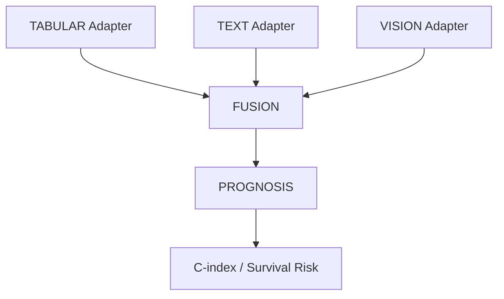

# CLINICAL-CORE / RENAL-CORE (Modular Modality Architecture)

End-to-end multimodal ecosystem for CLINICAL-CORE, validated on TCGA-KIRC. This repository implements a modular, modality-centric structure based on **Hexagonal Architecture** principles, where logic and models are isolated from external interfaces via **Adapters**.



## The Three Rules of the Ecosystem

1.  **Declarative configs**: Every decision lives in configuration YAMLs. No hardcoding in Python.
2.  **Structured provenance**: Every run is logged in a unique timestamped directory with a copy of its config.
3.  **Component Modularity**: Each modality (Tabular, Vision, Text) is self-contained with its own models and tools.

## File Structure

The project is organized into a modular hierarchy:

```
code/
├── main.py                     # Entry point shim
├── core/                       # 🏗️ Core Orchestration Layer (Domain/Ports)
│   ├── main.py                 # Multi-modal pipeline logic
│   ├── registry.py             # Master component registry
│   ├── experiment_runner.py    # Execution engine
│   └── model_utils.py          # Shared ML utilities
│
├── components/                 # 🧩 Modular Components (Hexagonal Expansion)
│   ├── adapters/               # 🔌 External Interface Handlers
│   │   ├── ingestion/          # e.g., tabular, vision, text modalities
│   │   │   ├── models/         # 🧠 Internal architectures (Encoders, Segmenters)
│   │   │   ├── utils/          # 🛠️ Component-specific tools (Sweeps, Extractors)
│   │   │   ├── configs/        # 📋 Component mapping schemas
│   │   │   └── experiments/    # ⚙️ Modality-specific experiment YAMLs
│   │   ├── channels/           # Future integrations
│   │   └── bridges/            # Future integrations
│   │
│   ├── procesors/              # ⚙️ Core processing and task logic
│   │   ├── fusion/             # Concatenation and aggregation strategies
│   │   └── prognosis/          # Linear Cox prediction
│   │
│   ├── explainers/             # 🔍 Interpretability (e.g. GraphRAG)
│   ├── monitors/               # 📊 System monitoring
│   └── external/               # 🏛️ Non-compliant baselines for reference
│
├── experiments/                # ⚙️ Global Experiment Configs
```

## Quick Start

1.  **Configure**: select your components in `code/experiments/experiment_config.yaml`.
2.  **Run**:
    ```bash
    python3 code/main.py --config experiments/experiment_config.yaml
    ```
3.  **Inspect**: Results are stored in `results/{run_id}/`.

## Multi-Modal Adapters

### VISION
- **`stunet`**: Uses STU-Net (SOTA medical segmentation) and TotalSegmentator.
- **`mock`**: Architectural validation with synthetic masks.

### TEXT
- **`clinicalbert`**: Docling extraction + ClinicalBERT embeddings.

### TABULAR
- **`cox_baseline`**: Cox Proportional Hazards baseline.
- **`tabpfn`**: Large In-Context Learning for tabular data.
- **`linear_compact`**: Resource-efficient linear encoder (formerly linear_fpga).

## Adding Components

1.  Implement your class in `code/components/<modality>/models/`.
2.  Register it in `code/core/registry.py`.
3.  Update your `.yaml` experiment config.

## What's New (v5 Refactor: Modality Centric)

The architecture has transitioned from a file-type grouping to **Modality-Centric Modularity**:
- **Hexagonal Alignment**: External interfaces are now strictly treated as **Adapters**, isolating the core domain logic.
- **Granular Components**: Each modality now explicitly separates its `models/` from its `utils/`.
- **Centralized Core**: Orchestrators moved to `core/` to leave the root clean.
- **Lazy Loading**: Heavy models (BERT, STU-Net) now use lazy initialization to speed up registry lookups.
