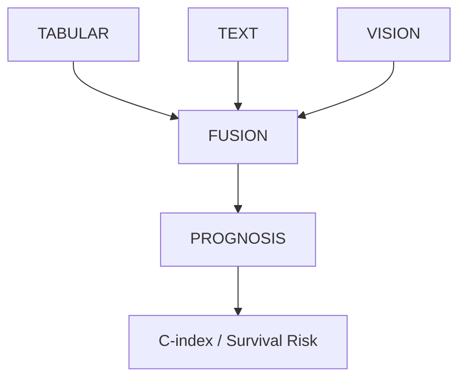

# CLINICAL-CORE / RENAL-CORE (Modular Modality Architecture)

End-to-end multimodal ecosystem for CLINICAL-CORE, validated on TCGA-KIRC. This repository implements a modular, modality-centric structure where logic, models, and utilities are self-contained within each component.



## The Three Rules of the Ecosystem

1.  **Declarative configs**: Every decision lives in configuration YAMLs. No hardcoding in Python.
2.  **Structured provenance**: Every run is logged in a unique timestamped directory with a copy of its config.
3.  **Component Modularity**: Each modality (Tabular, Vision, Text) is self-contained with its own models and tools.

## File Structure

The project is organized into a modular hierarchy:

```
code/
├── main.py                     # Entry point shim
├── core/                       # 🏗️ Core Orchestration Layer
│   ├── main.py                 # Multi-modal pipeline logic
│   ├── registry.py             # Master component registry
│   ├── experiment_runner.py    # Execution engine
│   └── model_utils.py          # Shared ML utilities
│
├── components/                 # 🧩 Modular Components
│   ├── tabular/                # Models (Cox, Compact), Utils (Sweep, Extractor)
│   ├── vision/                 # STU-Net, Radiomics, KiTS23 Finetuning
│   ├── text/                   # ClinicalBERT, Docling
│   ├── fusion/                 # Concatenation strategies
│   └── prognosis/              # Linear Cox prediction
│
├── experiments/                # ⚙️ Global Experiment Configs
└── configs/                    # 📋 Data Mapping Schemas (tabular_mapping.yaml)
```

## Quick Start

1.  **Configure**: select your components in `code/experiments/experiment_config.yaml`.
2.  **Run**:
    ```bash
    python3 code/main.py --config experiments/experiment_config.yaml
    ```
3.  **Inspect**: Results are stored in `results/{run_id}/`.

## Multi-Modal Connectors

### VISION
- **`stunet`**: Uses STU-Net (SOTA medical segmentation) and TotalSegmentator.
- **`mock`**: Architectural validation with synthetic masks.

### TEXT
- **`clinicalbert`**: Docling extraction + ClinicalBERT embeddings.

### TABULAR
- **`cox_baseline`**: Cox Proportional Hazards baseline.
- **`tabpfn`**: Large In-Context Learning for tabular data.
- **`linear_compact`**: Resource-efficient linear encoder (formerly linear_fpga).

## Adding Components

1.  Implement your class in `code/components/<modality>/models/`.
2.  Register it in `code/core/registry.py`.
3.  Update your `.yaml` experiment config.

## What's New (v5 Refactor: Modality Centric)

The architecture has transitioned from a file-type grouping to **Modality-Centric Modularity**:
- **Consolidated Components**: Models, utils, and configs are now co-located by modality (e.g., `components/tabular/utils/sweep.py`).
- **Centralized Core**: Orchestrators moved to `core/` to leave the root clean.
- **Rebranding**: `linear_fpga` has been officially renamed to `linear_compact` (Variant C).
- **Lazy Loading**: Heavy models (BERT, STU-Net) now use lazy initialization to speed up registry lookups.
