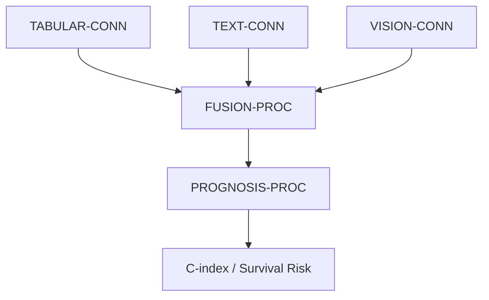

# CLINICAL-CORE / RENAL-CORE (Modular Architecture)

End-to-end multimodal ecosystem for CLINICAL-CORE, validated on TCGA-KIRC. This repository implements a modular pipeline where every component (ingestion, fusion, prognosis) is a swappable unit.



## The Three Rules of the Ecosystem

1.  **Declarative configs**: Every decision lives in `configs/*.yaml`. No hardcoding in Python.
2.  **Structured provenance**: Every run is logged in a unique timestamped directory with a copy of its config.
3.  **Component Swapping**: Adding a new backend requires ZERO changes to the orchestrator (`main.py`). Just implement, register in `registry.py`, and update the YAML.

## File Structure

The project is organized into a modular hierarchy:

```
code/
├── main.py                     # Primary orchestrator
├── registry.py                 # The "Master of Keys" (component registry)
│
├── components/                 # 🧩 Component Ecosystem
│   ├── connectors/             # 📡 Ingestion Layer
│   │   ├── tabular/            # cox_baseline, tabpfn_v2, linear_fpga
│   │   ├── vision/             # stunet (segmentation), radiomics (features)
│   │   └── text/               # clinicalbert
│   │
│   └── processors/             # 🧠 Reasoning Layer
│       ├── fusion/             # concatenation
│       └── prognosis/          # linear_cox
│
├── experiments/                # ⚙️ Experiment definitions (YAML battle plans)
├── configs/                    # 📋 Data schemas (config.yaml)
└── utils/                      # 🛠️ Helpers (extractor, model_utils, runner)
```

## Quick Start

1.  **Configure**: Edit `code/configs/experiment_config.yaml` to select your components.
2.  **Run**:
    ```bash
    python code/main.py
    ```
3.  **Inspect**: Results are stored in `results/{run_id}/`.

## Multi-Modal Connectors (CONNs)

### VISION-CONN
Three backends available, managed via `vision_backend` in config:
- **`totalseg`**: Uses TotalSegmentator for automated kidney ROI segmentation.
- **`stunet`**: Uses STU-Net (SOTA medical segmentation).
- **`mock`**: Architectural validation with synthetic masks.

### TEXT-CONN
- **`clinicalbert`**: Combines Docling for markdown extraction and ClinicalBERT for clinical embeddings.

### TABULAR-CONN
- **`cox_baseline`**: Raw feature padding.
- **`tabpfn`**: SOTA in-context learning (Hollmann et al., Nature 2025).
- **`linear_fpga`**: Optimized for hardware synthesis (Jetson-ready).

## Adding Components

1.  Implement your class in the appropriate `code/components/...` subdirectory.
2.  Import and add it to the corresponding dictionary in `code/registry.py`.
3.  Update your `.yaml` config to use the new string key.

For a detailed technical guide, see [docs/architecture.md](docs/architecture.md).

## What's New (v4 Refactor)

Recent updates have moved the project from a flat structure to a **Modular Ecosystem**:
- **Decomposed Encoders**: Large files like `encoders.py` were split into specialized modules.
- **Layered Processing**: Clear separation between Ingestion (Connectors) and Reasoning (Processors).
- **Clean Root**: Support scripts moved to `utils/` to improve maintainability.
